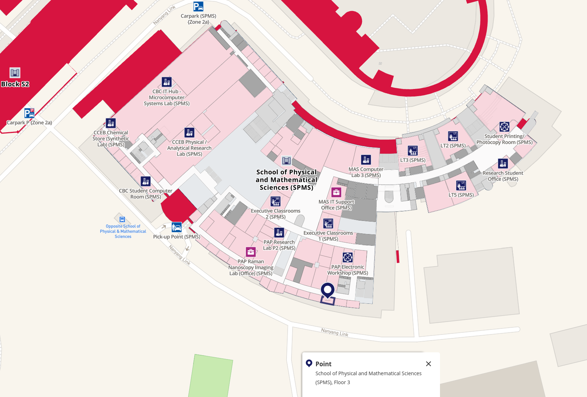
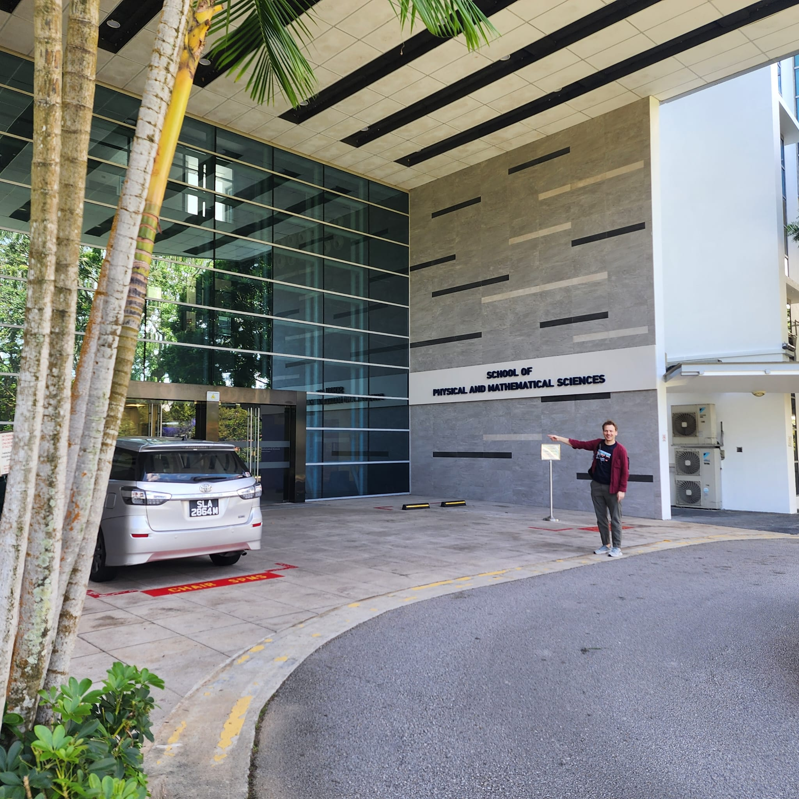
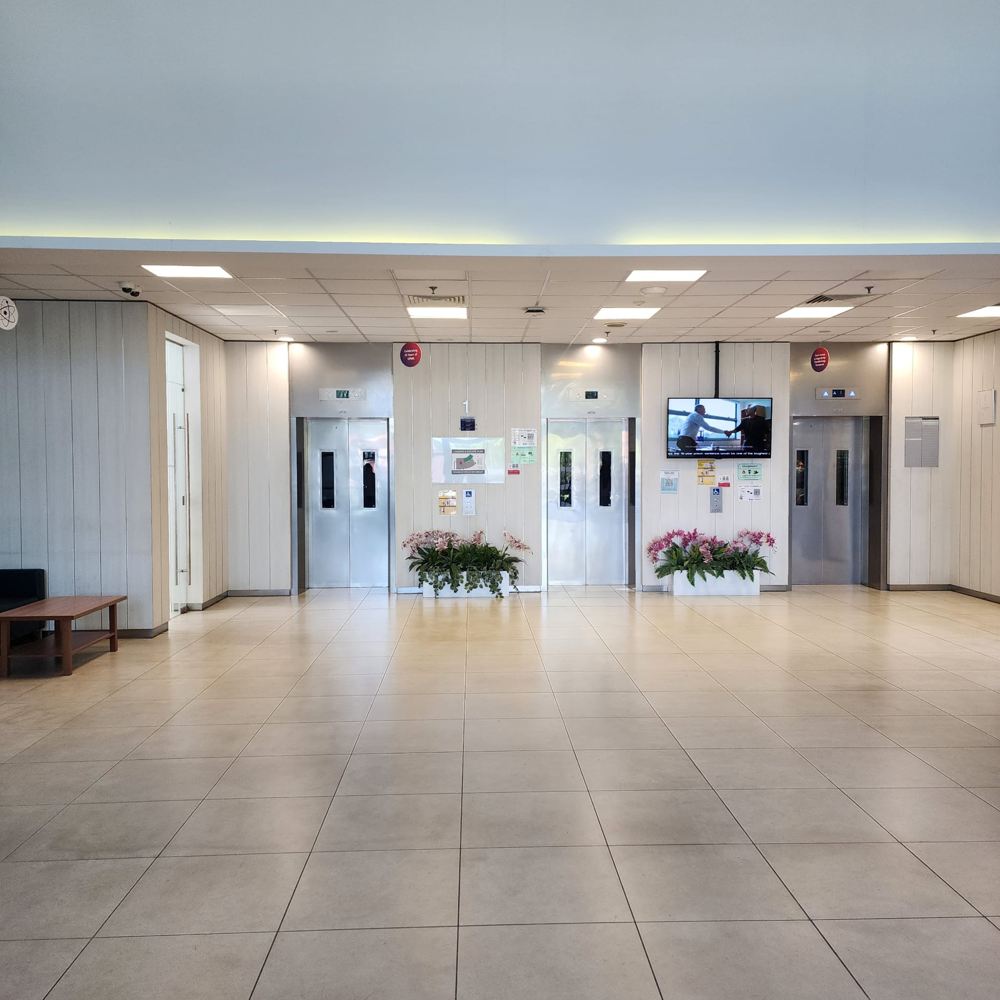
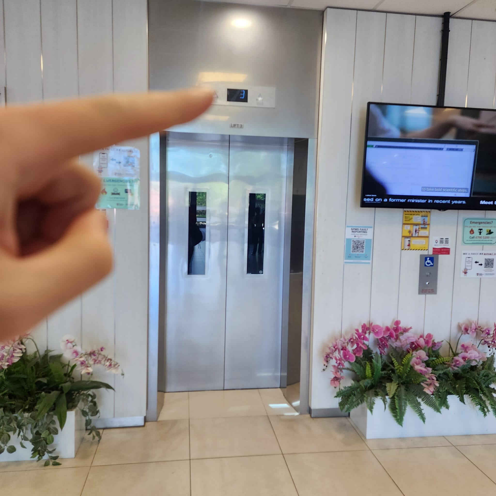
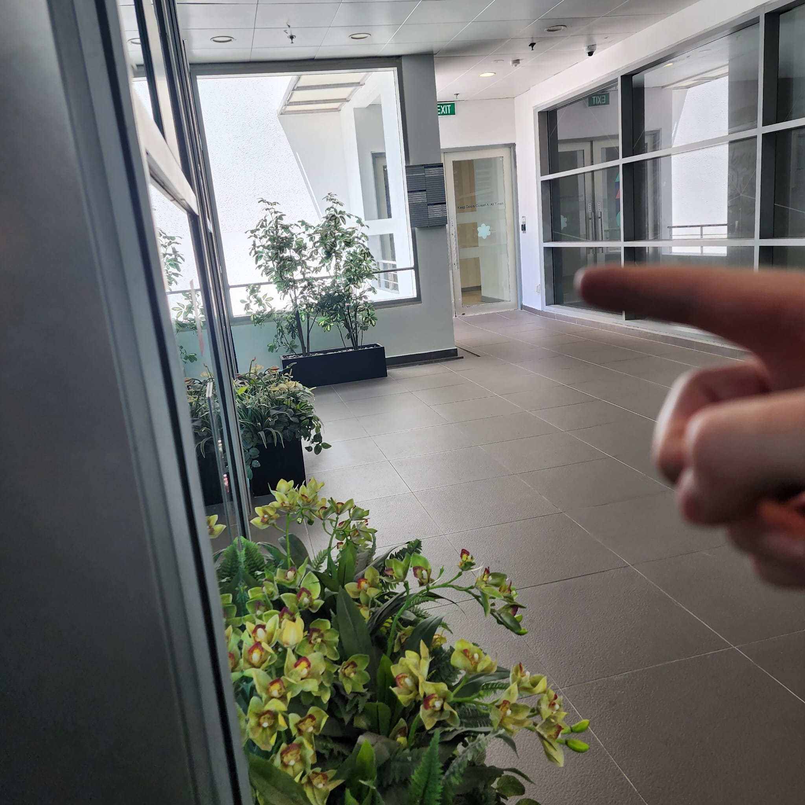
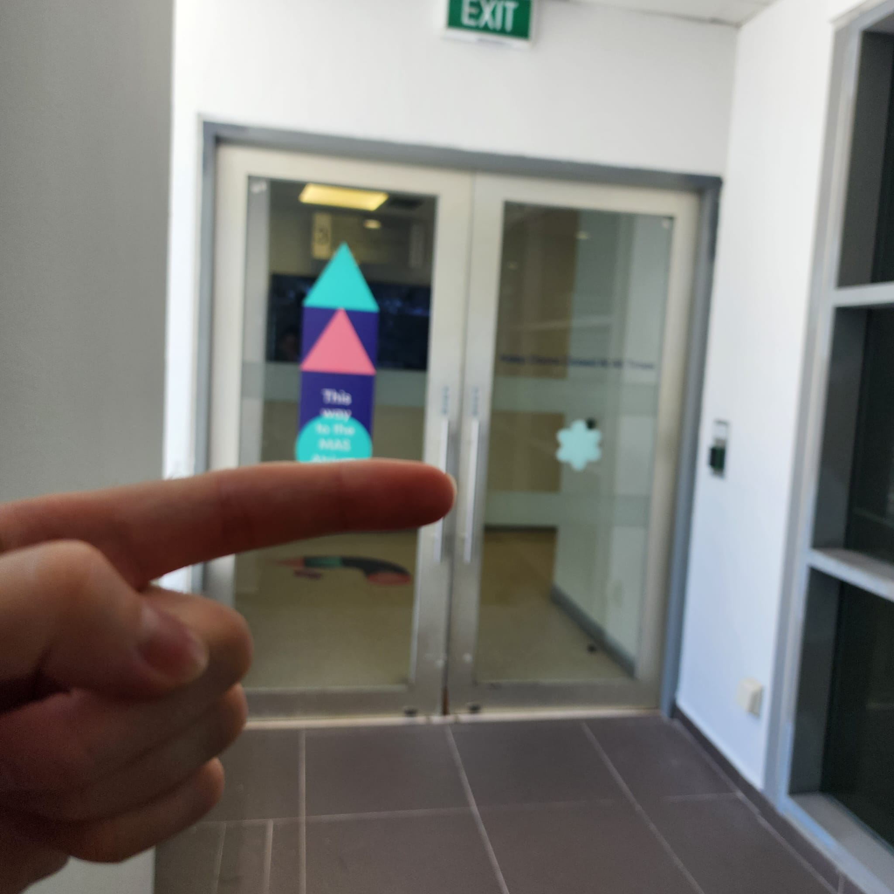
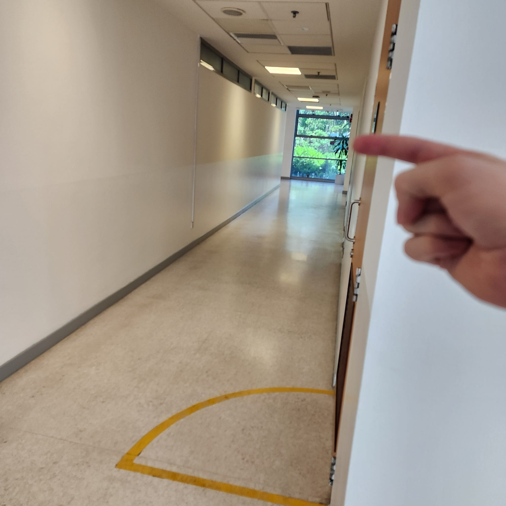
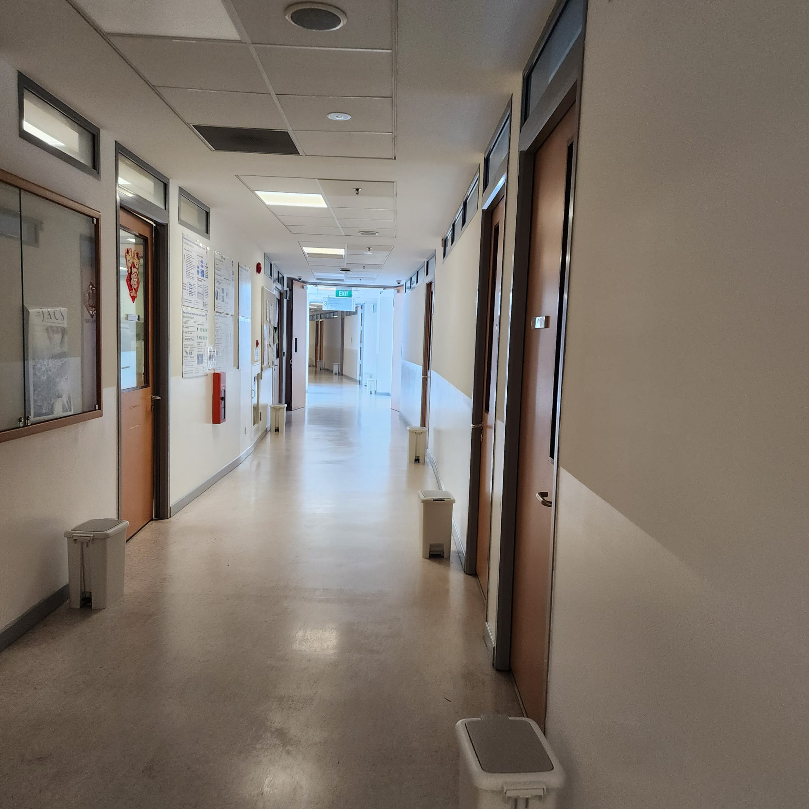
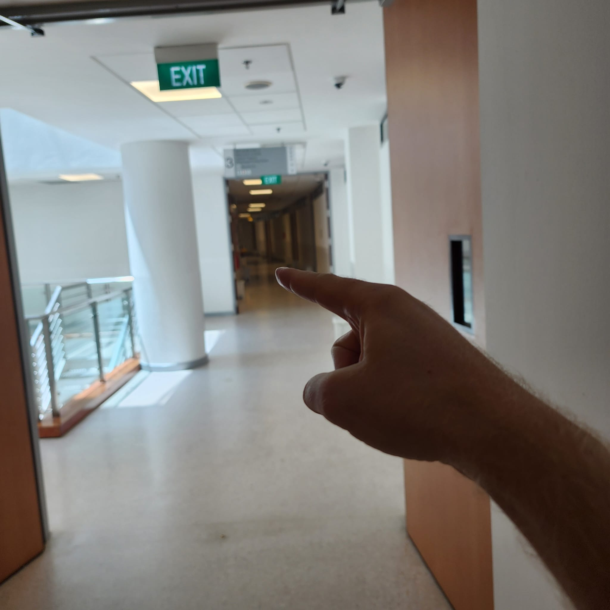
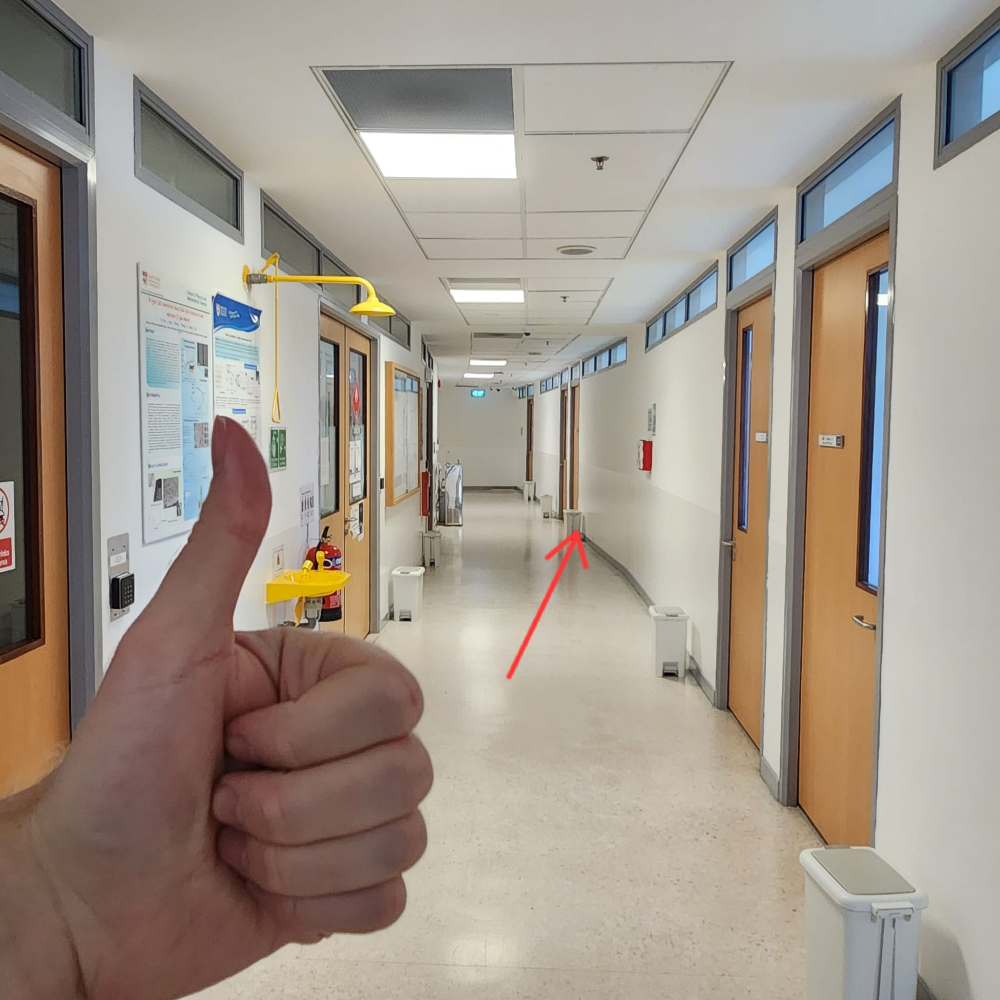

Marek's office is located at the pin on [this map](https://maps.ntu.edu.sg/?mazemap_share_url=https%3A%2F%2Fuse.mazemap.com%2F%3Futm_medium%3Dlongurl%23v%3D1%26config%3Dntu-sg%26zlevel%3D3%26center%3D103.682088%2C1.341895%26zoom%3D19%26campusid%3D2123%26sharepoitype%3Dpoi%26sharepoi%3D1003300012)

If you arrive by taxi at the drop-off called Lobby of SPMS at NTU (https://maps.app.goo.gl/MaxUx1Fq4u2uXGZC8)

then enter through the main door and walk towards the elevators

take an elevator to lvl 3

go left (to PAP and MAS, not chemistry to the right)

when you enter PAP go right 

follow the corridor to the left

trust this guide and head on

the office is diagonally across from the building from the elevator

so just continue to the corner of the building

